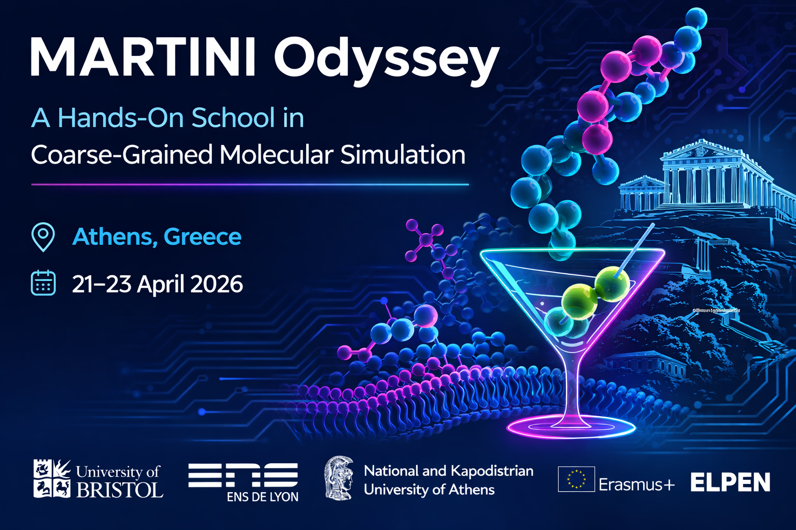

  

# 🍸 MARTINI Odyssey — Athens 2026 🇬🇷

📣 **Registration is now OPEN!**

We are excited to announce the opening of registration for **MARTINI Odyssey: A Hands-On School in Coarse-Grained Molecular Simulation**, taking place **21–23 April 2026** at the **Department of Pharmacy (Pharmaceutical Chemistry Section), National and Kapodistrian University of Athens (NKUA)**.

This intensive **3-day school** combines lectures and guided hands-on tutorials, providing both **fundamental understanding and practical experience** with the **Martini 3 coarse-grained force field**, spanning biomolecular and pharmaceutical applications.

---

## 🔬 Scientific Programme

Topics include:

- Fundamentals of coarse-graining and the Martini ecosystem  
- Membrane, lipid and protein modelling workflows  
- Advanced CG system construction and simulation tools  
- Small-molecule parametrization and ligand binding  
- Liposomes and lipid nanoparticle (LNP) simulations  
- Membrane protein simulations and complex biological membranes  

---

## 👩‍🔬 Expert Instructors

International speakers and instructors include:

- **Paulo C. Telles de Souza** — ENS de Lyon / CNRS  
- **Robin Corey** — University of Bristol  
- **Antonios Kolocouris** — National and Kapodistrian University of Athens
- **Matthieu Chavent** — Université de Toulouse / CNRS  
- **Dimitrios Kolokouris** — University of Copenhagen  
- **Luís Borges Araújo** — ENS de Lyon / CNRS  
- **Fabian Schuhmann** — University of Copenhagen  
- **Mariana Valério** — ENS de Lyon / CNRS
- ***Ilias Patmanidis** - University of Groningen
- **Saman Fatihi** — Biomedical Research Foundation of the Academy of Athens  
- **Nishita Mandal** — Biomedical Research Foundation of the Academy of Athens
- **Chelsea Brown** - University of Groningen
- **Marieke Westendorp** - University of Groningen
- and additional contributors.

---

## 🏭 Industrial & HPC Support

One day of the event will be hosted at **Athens LifeTech Park – ELPEN Pharmaceutical Co. Inc.**, focusing on pharmaceutical applications.

Hands-on sessions are supported by:

- **ARIS Supercomputer** (GRNET – Greek Research & Technology Network)  
- **Dr. Dimitris Dellis**  
- **Dr. George Lambrinidis (NKUA)** for prioritised **GROMACS** access

---

## 🤝 Activities

- Poster & flash-talk discussions *(poster presenters prioritised)*  
- Networking activities including **Acropolis / museum visit** 🏛️  
- Greek food and informal scientific discussions 🍽️  

---

## 📄 Application

Send the following to:

📧 **cocadds@pharm.uoa.gr**

- Statement of motivation  
- Poster title + abstract *(optional but prioritised)*  

⚙️ **Basic Linux knowledge required.**  
Some **GROMACS preparation** may be requested.

💶 **No registration fees.**  
Travel and accommodation are **not covered**.

📅 **Application deadline:** **31 March 2026**

---

# 📅 Programme

## Day 1 — Martini Fundamentals

| Time | Activity |
|-----|-----|
| 09:30 – 10:00 | Registration |
| 10:00 – 10:10 | Welcome — **E. Mikros, P. C. T. Souza, R. Corey, A. Kolocouris** |
| 10:10 – 10:55 | Introduction to Coarse-Graining and Martini — **Paulo C. T. Souza** |
| 10:55 – 11:40 | Martini models for biomolecules / Martini ecosystem — **Luís Borges Araújo** |
| 11:40 – 12:10 | Coffee break |
| 12:10 – 12:55 | Advanced tools / TS2CG — **Ilias Patmanidis & Fabian Schuhmann** |
| 13:00 – 14:00 | Lunch |
| 14:00 – 17:00 | **Hands-on Session 1:** Basics of Martini (bead properties, membranes, proteins, TS2CG) |
| 17:00 – 19:00 | Poster session & gathering |

---

## Day 2 — Pharmaceutical Applications

| Time | Activity |
|-----|-----|
| 09:30 – 10:00 | Transport to ELPEN |
| 10:00 – 10:10 | Welcome — **ELPEN representative** |
| 10:10 – 10:55 | Parametrization of Martini models — **Paulo C. T. Souza** |
| 10:55 – 11:40 | Binding small molecules / GPCRs — **Matthieu Chavent** |
| 11:40 – 12:10 | Coffee break |
| 12:10 – 12:55 | Computational modelling of liposomes / LNPs — **Mariana Valério** |
| 13:00 – 14:00 | Lunch |
| 14:00 – 15:00 | Transport back to NKUA |
| 15:00 – 18:00 | **Hands-on Session 2:** Parametrization, ligand binding, liposomes/LNPs |
| 19:30 | Speaker dinner |

---

## Day 3 — Biological Applications

| Time | Activity |
|-----|-----|
| 10:00 – 10:10 | Welcome — **Robin Corey** |
| 10:10 – 10:55 | Transmembrane proteins — **Dimitrios Kolokouris & Robin Corey** |
| 10:55 – 11:40 | Peripheral membrane proteins — **Saman Fatihi & Nishita Mandal** |
| 11:40 – 12:10 | Coffee break |
| 12:10 – 12:55 | Complex biological membranes: mitochondrial cristae — **Chelsea Brown & Marieke Westendorp** |
| 13:00 – 14:00 | Lunch |
| 14:00 – 17:00 | **Hands-on Session 3:** Building, running, analysing and visualising membrane protein simulations |
| 17:00 – 20:00 | Optional **Acropolis / museum visit** |

---

## 🎓 Organisers

- **École normale supérieure de Lyon** — Paulo C. Telles de Souza  
- **University of Bristol** — Robin Corey  
- **National & Kapodistrian University of Athens** — Antonios Kolocouris  

Supported by the **Erasmus+ exchange programme**.

---

We look forward to welcoming you in **Athens!**

`#Martini3` `#MolecularDynamics` `#ComputationalChemistry` `#Biophysics`  
`#DrugDiscovery` `#CoarseGrainedModeling` `#Athens2026`
